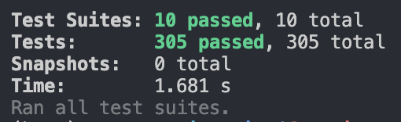

# Report for assignment 4

## Project

Name: Bitfocus Companion

URL: [Bitfocus](https://github.com/bitfocus/companion), [Fork](https://github.com/dd2480-group14-2024/companion)

"Bitfocus Companion enables the reasonably priced Elgato Streamdeck to be a professional shotbox surface for a huge amount of different presentation switchers, video playback software and broadcast equipment."

## Onboarding experience

The project we worked on in assignment 3 did not have a very active community, a lot of tests failed and the documentation was very poor so we chose to go with another project this time around. The experience was completely different. Bitfocus Companion has a very active community of developers and users so it was more fun to work on. The documentation was well made and consisted of step-by-step guides on how to set up the developer environment for any platform, and there were also other useful documents available for developers such as information on how to contribute to the project.

## Effort spent

__Leo Vainio__
| What                                  | Time (hours) | Comment |
| ------------------------------------- | ------------ | ------- |
| plenary discussions/meetings          | 1            | Meeting to setup project        |
| discussions within parts of the group | 2            | Helping with setup and cofig        |
| reading documentation                 | 3            |    Learning react and reading through docs of the Bitfocus Companion repository.       |
| configuration and setup               | 1            | Had some dependency issues in the beginning but once following the steps in the docs it worked fine        |
| analyzing code/output                 | 4           |         |
| writing documentation                 | 2            | Creating UML diagram and adding stuff to this report       |
| writing code                          | 10            | In the beginning, some time was spent trying to understand the project and how different classes interacted. I was a bit rusty at JS and have never used React which made it a bit harder, but in the end it wasn't too hard to implement the feature. I implemented the duplicate step button (Issue #2584) and wrote a test for it. Writing tests took some time also since I wasn't familiar with the framework.        |
| running code                          | 1           |    The project takes a minute to build so running it after changes was a bit tedious at times but not too bad.    |

__Teodor Morfeldt Gadler__
| What                                  | Time (hours) | Comment |
| ------------------------------------- | ------------ | ------- |
| plenary discussions/meetings          | 1            | 1 meeting to setup project        |
| discussions within parts of the group | 1            | Mostly related to setup issues        |
| reading documentation                 | 2            | Read  all I could find whil troubleshooting setup        |
| configuration and setup               | 3            | 3. Spent almost all of it to try to get the project to run using WSL. Worked almost immediately with mac.        |
| analyzing code/output                 | 10           | Mostly spent trying to find a way to get a list of all controls/buttons in the application        |
| writing documentation                 | 1            |         |
| writing code                          | 8            | Lots of troubleshooting related to my lack of experience with React and TypeScript        |
| running code                          | <1           | Sort of the same as "analyzing output"        |

__Luna Chen__
| What                                  | Time (hours) | Comment |
| ------------------------------------- | ------------ | ------- |
| plenary discussions/meetings          | 1            |         |
| discussions within parts of the group | 2            |         |
| reading documentation                 | 2            |         |
| configuration and setup               | 4            |         |
| analyzing code/output                 | 4            |         |
| writing documentation                 | 2            |         |
| writing code                          | 6            |         |
| running code                          | 1            |         |

__Jodie Ooi__
| What                                  | Time (hours) | Comment |
| ------------------------------------- | ------------ | ------- |
| plenary discussions/meetings          | 1            |         |
| discussions within parts of the group | 2            |         |
| reading documentation                 | 2            |         |
| configuration and setup               | 4            |         |
| analyzing code/output                 | 4            |         |
| writing documentation                 | 2            |         |
| writing code                          | 6            |         |
| running code                          | 1            |         |

__William Nordwall__
| What                                  | Time (hours) | Comment |
| ------------------------------------- | ------------ | ------- |
| plenary discussions/meetings          | 1            |         |
| discussions within parts of the group | 1            |         |
| reading documentation                 | 4            |         |
| configuration and setup               | 3            |         |
| analyzing code/output                 | <1            |         |
| writing documentation                 | 8            |         |
| writing code                          | <1            |         |
| running code                          | <1            |         |

## Overview of issues and work done.

__Title: Add "Duplicate Step" button #2584__

URL: [#2584](https://github.com/bitfocus/companion/issues/2584)

Summary: The software includes a feature that allows users to associate a button with specific sequences of actions, which can be executed step by step. Occasionally, steps involve very similar action sequences. To address this, the feature incorporates a button that enables the duplication of a step, eliminating the need for users to redo work over and over.

Scope: The implementation required changes to five different source files. The change affects one component in the emulator software but code had to be written for the server as well to handle the websocket communication.

__Title: List of where variable is used #2581__

URL: [#2581](https://github.com/bitfocus/companion/issues/2581)

Summary: The software supports the use of variables that can be used to modify the action or visuals of buttons/controls. The software provides a view of all the variables. The goal is to add information about where (as in by what button) and how each variable is used to this view.

Title: Add Custom Names to Step Tabs #2605

URL: [#2605](https://github.com/bitfocus/companion/issues/2605)

Summary: The software includes a feature that allows users to associate a button with specific sequences of actions, which can be executed step by step. This feature enables users to customize what they want to name the steps which can help with organization and for finding specific tasks. Currently, the steps are automatically named in order (ex: Step 0, Step 1, Step 2) with no option of customizing the names.

Scope: The implementation required changes to seven different source files. The change affects one area in the emulator software but code had to be written to change the UI, the format of the button, as well as the server to handle the websocket communication for data persistence.

## Requirements for the new feature or requirements affected by functionality being refactored

### #2584 Add duplicate step button

R1: User interface. 

A button for duplicating a step should be added to the edit button component in the web UI next to the already existing "add step" and "remove step" buttons. 

R2: Feature description.

Users should be able to duplicate a step when editing a button's functionality. When duplicating a step, a new step should be created for the button that contains a copy of the sequence of actions that exist in the current step. 

R3: Integration.

The feature should integrate seamlessly with the current software and should not cause any breaks somewhere else.

### #2581 List of where variable is being used

R1: User interface. 

A list of where each variable is being used should be added to the current view of all variables

R2: Feature description.

For each use of a variable the view should show which button uses it and how (e.g. action/feedback/name)

R3: Integration.

The feature should integrate seamlessly with the current software and should not cause any breaks somewhere else.
### #2605 Add custom names to step tabs

R1: User Interface Enhancement

A user should have the ability to assign custom names to step tabs within the edit button component of the web UI. This functionality should be accessible and intuitive, possibly through an inline edit option directly on the step tab or by double clicking the step tab.

R2: Feature Functionality

Upon clicking or selecting a step tab, users should be presented with an option to rename the step. The new name should be saved upon user confirmation like pressing Enter and should persist across sessions.

R3: Data Persistence and Integration

The custom names assigned to step tabs should be stored persistently, ensuring that the names are retained across different sessions and are not lost upon refreshing or reopening the web application. This feature should integrate with the backend to save the custom step names, ensuring compatibility with the current data models and workflows.

## Code changes

### Patch

#### #2581 List where variables are used
`git diff feat/issue-2581/list-of-variables-are-used..main`

`Variable.js`, `SocketIO.js` and `CustomVariableList.tsx` are the files that are affected by this patch.

Optional (point 4): the patch is clean. Yes, it is.

Optional (point 5): considered for acceptance (passes all automated checks). Yes.

#### #2584 Add duplicate step button

[#2584](https://github.com/dd2480-group14-2024/companion/tree/feature/issue-2584/add-duplicate-step-button) 

`EditButton.tsx`, `SocketIO.ts`, `IControlFragments.js`, `Controller.js` and `Normal.js` are the files that are affected by this patch.

Optional (point 4): the patch is clean. Yes, it is.

#### #2605 Add Custom Names to Step Tabs

[#2605](https://github.com/dd2480-group14-2024/companion/tree/feature/issue-2605/add-custon-step-name)

Optional (point 4): the patch is clean.

Optional (point 5): considered for acceptance (passes all automated checks).

## Test results

### Before

[Logs before](https://github.com/dd2480-group14-2024/assignment4/blob/main/test_logs/log_before.txt)

### After #2581

I did not have the time to complete the implementation of additional unit tests.

### After #2584

Optional (Point 3, tracability)
There were no specific tests for this issue before we started but one test was added (linked below) which is mostly linked to requirement R2 which is specified further up in the document. It checks that the duplicated step is a copy of the original one and not the same object. As seen in the logs below it is also clear that requirement R3 is fulfilled since the implementation causes no breaks in the other tests.

[Link to test](https://github.com/dd2480-group14-2024/companion/blob/feature/issue-2584/add-duplicate-step-button/companion/test/Service/Duplicate.test.js)

[Logs after](https://github.com/dd2480-group14-2024/assignment4/blob/main/test_logs/log_after_2584.txt)

### After #2605

There were no specific tests for this issue either but one test was added. It checks that a step is renamed and that the new name for that step is the same as what we had planned to rename it to. It also fulfills the requirement that the implementation does not cause other tests to break.

[Link to test](https://github.com/dd2480-group14-2024/companion/blob/feature/issue-2605/add-custon-step-name/companion/test/Service/Rename.test.js)

## UML class diagram and its description

### Key changes/classes affected

#### #2584 UML diagram

The project uses the very popular model view controller (MVC) design pattern for their web UI interface. The diagram below contains the methods and fields in the classes that are affected by the patch for this issue and some other relevant ones. The client (EditButton class), which is part of the view (the web UI), sends a websocket emit event to the controller on the server side when a user presses a specific button in the UI. The handler calls the corresponding function in the ControlButtonNormal class which implements the ControlWithSteps interface. When the step has been added/duplicated the change is saved on the server, and the controller sends back the id of the new step to the client (EditButton). The ClientToBackendEventMap interface contains definitions for all the socket handler functions which the controller implements.

#### #2605 UML diagram

## Code changes

## UML class diagram and its description

### Key changes/classes affected

Optional (point 1): Architectural overview.

Optional (point 2): relation to design pattern(s).

## Overall experience

What are your main take-aways from this project? What did you learn?

The major thing we learned from this was about contributing to open source projects. We practiced getting involved in a project by first reading the documentation to get a grasp of what the project was about, and then found interesting issues to resolve.

How did you grow as a team, using the Essence standard to evaluate yourself?

Our team is still in the performing stage. The team is working well together, and we are able to work autonomously. We are usually able to meet all of our commitments, and we are able to adapt our way of workig to suit each assignment. After the completion of this final lab, the team will enter the adjourned state, as we will have accomplished everything we set out to do. During the course, our communication and understanding of each other has improved, which has led to more effective teamwork and a clearer division of tasks. This could of course still be improved further. We usually don't have many meetings apart from an initial one to distribute responsibilities. Having more regular meetings to stay synced with one another is one possible improvement to make sure we are always on the same page.

Optional (point 6): How would you put your work in context with best software engineering practice?

Below we cover the alphas: Requirements, Software System, Stakeholders and Work.

- Benefits of work carried out
  - One major benefit of the work we carried out is that, since more issues have been resolved, more requirements have been met, meaning        that the requirements alpha has gotten closer to being fullfilled. This also entails that the state of the software system has been         improved. The issues we worked on mainly served to improve the user experience, meaning that the system could be more easily operated,      making it more usable.
- Drawbacks of work carried out
  - A potential drawback of the work carried out could be that the new feature also introduces new requirements which must be met, meaning      that the "coherent" stage might have to be revisited, as we might have to reconsider which core characteristics we want the system to       have. Stakeholders of the project might also have to get involved and come to an agreemen on whether or not the change is desirable.
- Limitations of work carried out
  - A major limitation is the time constraint we had, since the assignment had to be submitted within two weeks. This limited the amount of     issues we could look at and features we could implement. If we had had more time, it would have been possible to conclude the work with     greater results achieved.

Optional (point 7): Is there something special you want to mention here?

Optional (point 8): In the context of Jonas Öberg's lecture last week, where do you put the project that you have chosen in an ecosystem of open-source and closed-source software? Is your project (as it is now) something that has replaced or can replace similar proprietary software? Why (not)?

As the code is available for anyone to access, and since there is a licese which clearly states that anyone can contribute to and use the code as they wish, the project can definitely be considered an open source project. As far as we can tell, this project won't replace ay proprietary software, as it is hard to find other proprietary projects which cover the same area as this.
